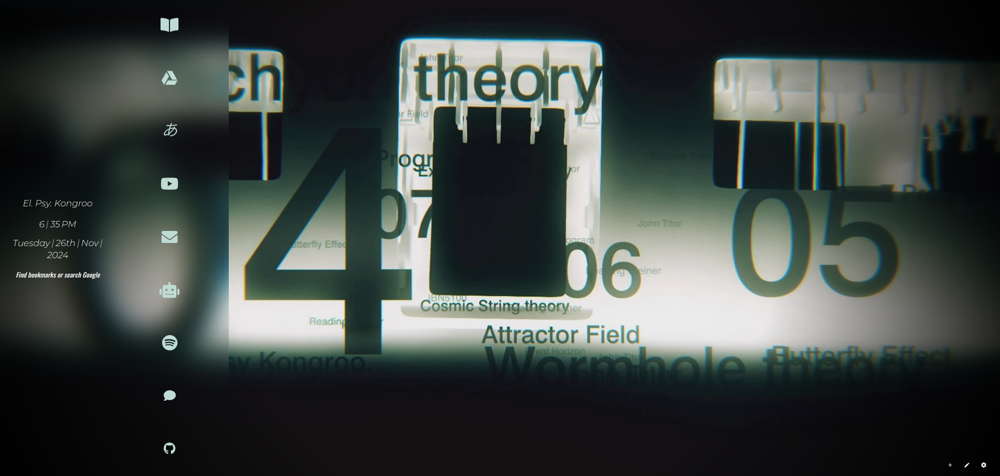

# Cosmic-Looper
Hello! This is a nightTab theme based on the S;G Elite intro "Cosmic Looper"

# How-to
In order to use this theme:

&nbsp; I. Make sure to install the nightTab extension in your browser of choice (where available)

&nbsp; II. Download the .json file located in this repo. It will automatically take the jpg also in this repo, so no need to download. If you want to change it, make sure to specify a different url (non-local) when configuring the theme

&nbsp; III. On nightTab, make sure to visit the changes and click on the data tab. Import the .json file and you'll be set!

Thanks for checking it out :)

El. Psy. Kongroo.
